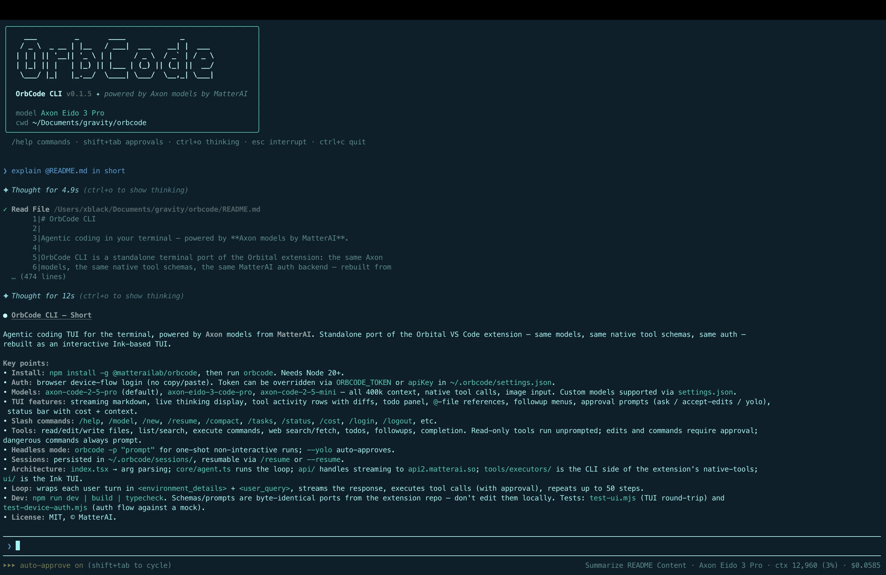

# OrbCode CLI

[](https://www.npmjs.com/package/@matterailab/orbcode)
[](https://www.npmjs.com/package/@matterailab/orbcode)
[](./LICENSE)
[](https://nodejs.org)
[](https://github.com/MatterAIOrg/OrbCode)
[](https://github.com/MatterAIOrg/OrbCode/issues)
[](https://docs.matterai.so/orbcode-cli/overview)

Agentic coding in your terminal — powered by **Axon models by MatterAI**.

> 📖 **Full documentation: <https://docs.matterai.so/orbcode-cli/overview>**

OrbCode CLI is a standalone terminal port of the Orbital extension: the same Axon
models, the same native tool schemas, the same MatterAI auth backend — rebuilt from
scratch as an interactive TUI with streaming chat, live thinking display, tool
activity rows, edit/command approvals, and todo tracking.



---

## Table of contents

- [Quick start](#quick-start)
- [Install](#install)
- [Updating / relinking](#updating--relinking)
- [Usage](#usage)
- [Authentication](#authentication)
- [Models](#models)
- [The TUI](#the-tui)
- [Slash commands](#slash-commands)
- [Keyboard shortcuts](#keyboard-shortcuts)
- [Approvals & safety](#approvals--safety)
- [Headless mode](#headless-mode)
- [Configuration](#configuration)
- [Hooks](#hooks)
- [MCP servers](#mcp-servers)
- [Skills](#skills)
- [AGENTS.md memory](#agentsmd-memory)
- [Architecture](#architecture)
- [Tools](#tools)
- [Agent loop](#agent-loop)
- [Development](#development)
- [Tests](#tests)
- [Troubleshooting](#troubleshooting)
- [Documentation](#documentation)
- [Contributing](#contributing)
- [License](#license)

---

## Quick start

```bash
npm install -g @matterailab/orbcode   # install the CLI (needs Node.js >= 20)
orbcode login                          # sign in once via your browser
cd your-project && orbcode             # start coding
```

That's it — you're in an interactive agent session. Ask it to read, edit, run
commands, or fix bugs. New here? Skim the [docs](https://docs.matterai.so/orbcode-cli/overview)
or jump to [Usage](#usage).

Prefer not to install globally? Run it on the fly:

```bash
npx @matterailab/orbcode
```

## Install

Requires **Node.js >= 20**.

```bash
npm install -g @matterailab/orbcode
```

Then, from any project directory:

```bash
orbcode
```

To update later: `npm update -g @matterailab/orbcode` (or re-run the install command).

### From source (development)

```bash
git clone https://github.com/MatterAIOrg/OrbCode.git
cd OrbCode
npm install
npm run build
npm link        # exposes the global `orbcode` command
```

## Updating / relinking

`npm link` creates a **symlink** to this repo, so after pulling changes you only
need to rebuild — no relink required:

```bash
npm run build   # the linked `orbcode` command picks this up immediately
```

Relink only when the package **name or bin entry changes** (e.g. the package was
renamed `orbitalcode` → `orbcode`):

```bash
npm unlink -g orbitalcode   # remove a stale link under the old name (once)
npm link
```

The version reported by `orbcode --version` is read from `package.json` at
runtime — bumping the version there is all that's needed.

## Usage

```
orbcode                 start an interactive session in the current directory
orbcode "<prompt>"      start an interactive session with an initial prompt
orbcode login           sign in to MatterAI (browser device flow)
orbcode -p "<prompt>"   run a single prompt non-interactively, print only the final response
orbcode -p "…" --yolo   non-interactive with edits/commands auto-approved
orbcode --model <id>    use a specific model for this run (also -m)
orbcode --resume <id>   resume a previous session by id (also -r)
orbcode --version       print version
orbcode --help          show help
```

The TUI always takes over the full terminal screen on launch (prior shell
output stays in scrollback).

The directory you launch from becomes the **workspace directory**: the default
target for file operations and commands, and the file listing the model sees in
its environment details.

## Authentication

Browser-based device flow with polling (no copy/paste needed):

1. `orbcode login` (or `/login` in the TUI) calls `POST /orbcode/auth/start` on
   the MatterAI backend, which issues a one-time 48-hex **device code**
   (10-minute lifetime, stored in redis).
2. The CLI opens
   `https://app.matterai.so/orbital?loginType=orbcode&devicecode=<code>` in your
   browser:
   - **Already signed in** → the webapp shows the **Authorize OrbCode CLI**
     dialog immediately.
   - **Not signed in** → you're redirected to sign-in first. The `devicecode`
     query param is preserved through the OAuth state (Google/Microsoft) and the
     email/password path, so the authorize dialog appears right after sign-in.
3. Clicking **Authorize** binds your session token to the device code
   (`POST /orbcode/auth/authorize`).
4. Meanwhile the CLI polls `GET /orbcode/auth/poll?devicecode=…` (every 3s by
   default, bounded by the code's lifetime). The token is handed out **exactly
   once** — the redis key is deleted on first successful poll.
5. The CLI verifies the token against the profile endpoint and saves it.

Fallbacks & overrides:

- **settings.json key**: set `apiKey` in `~/.orbcode/settings.json` (or a
  project's `.orbcode/settings.json`) to skip login. The login screen itself is
  browser-redirect only.
- **Env token**: set `MATTERAI_TOKEN` to skip login entirely (takes precedence
  over everything).
- **Dev endpoints**: `MATTERAI_BACKEND_URL` (default `https://api.matterai.so`)
  and `MATTERAI_APP_URL` (default `https://app.matterai.so`) override where the
  device flow points — useful against a local backend/webapp.
- Tokens are MatterAI JWTs. A token whose payload has `env: "development"`
  automatically routes API calls to `http://localhost:3000`, matching the
  extension's behavior.

Sign out with `/logout` (removes the saved token).

## Models

The built-in Axon models are listed below; `/model` opens a scroll-and-select
picker (`/model <id>` still selects directly). Additional models can be
declared via `customModels` in settings.json. The choice persists across
sessions.

| id                        | context | max output | pricing                |
| ------------------------- | ------- | ---------- | ---------------------- |
| `axon-eido-3-code-pro`    | 400k    | 64k        | $3/M in · $9/M out     |
| `axon-eido-3-code-mini`   | 400k    | 64k        | $1.5/M in · $4.5/M out |
| `axon-code-2-5-pro`       | 400k    | 64k        | $2/M in · $6/M out     |
| `axon-code-2-5-mini`      | 400k    | 64k        | free                   |

`axon-eido-3-code-mini` is the default. All four support native JSON tool calls
and image input. Cost comes from the API's usage chunks (`is_byok`-aware) and is
shown in the status bar.

### Other providers (Anthropic, OpenAI-compatible)

The Axon models go through the MatterAI gateway as before. A `customModels`
entry that sets a `provider` is instead served through the
[Vercel AI SDK](https://sdk.vercel.ai), reusing the same agent loop, tools, and
approvals — auth is the provider's own key (env var or `apiKey`), not the
MatterAI login.

```json
{
  "model": "claude-opus-4-8",
  "customModels": [
    {
      "id": "claude-opus-4-8",
      "name": "Claude Opus 4.8",
      "provider": "anthropic",
      "contextWindow": 1000000,
      "maxOutputTokens": 64000,
      "inputPrice": 0.000005,
      "outputPrice": 0.000025,
      "effort": "high"
    },
    {
      "id": "some-model",
      "provider": "openai-compatible",
      "baseUrl": "https://api.other-host.com/v1"
    }
  ]
}
```

- `provider: "anthropic"` → native `/v1/messages` (`@ai-sdk/anthropic`). Key from
  `ANTHROPIC_API_KEY` (or `apiKey` on the entry). Adaptive thinking + reasoning
  streaming are on by default; `effort` (`low`…`max`) tunes depth; prompt
  caching breakpoints are set on the system prompt and conversation prefix
  automatically. Thinking blocks are preserved across turns (stored with the
  session and replayed with their signatures), so interleaved thinking with
  tool use round-trips correctly. Set `"reasoning": false` to disable thinking
  (e.g. for models that don't support `effort`).
- `provider: "openai-compatible"` → any OpenAI-compatible endpoint; requires
  `baseUrl`. Key from `apiKey` on the entry.

> **Note:** Third-party models are **not** shown in the TUI's `/model` picker.
> They're still available headlessly via `orbcode -p "..." --model <id>` (or
> `MATTERAI_MODEL=<id>`); in an interactive session, `/model claude-opus-4-8`
> prints the exact command to run.

Anything without a `provider` (or `provider: "matterai"`) keeps using the
MatterAI gateway untouched.

## The TUI

```
  ___         _       ____             _
 / _ \  _ __ | |__   / ___|  ___    __| |  ___
| | | || '__|| '_ \ | |     / _ \  / _` | / _ \
| |_| || |   | |_) || |___ | (_) || (_| ||  __/
 \___/ |_|   |_.__/  \____| \___/  \__,_| \___|
```

- **Streaming responses** rendered as markdown (headers, lists, code fences,
  inline code, links) via a lightweight ANSI renderer.
- **Thinking**: reasoning streams live under `✦ Thinking…` (last few lines,
  dimmed) and collapses to `✦ Thought for Ns` when done. `ctrl+o` toggles
  expanded thinking for subsequent turns. Reasoning arrives from the API as
  `reasoning`/`reasoning_content` deltas or inline `<think>…</think>` blocks —
  all are routed to the thinking display.
- **Tool rows**: each tool call shows a formatted name ("Read File", "Execute
  Command"…), one-line summary (file path, command, query…), live "running"
  state, then `✓`/`✗` with a short result preview.
- **Edit diffs**: file-modifying tools render a real diff — stats header
  ("Added 2 lines, removed 1 line"), line-number gutter, red/green backgrounds —
  both in the approval prompt (before anything is written) and in the finished
  tool row.
- **Tasks**: the model maintains a checklist via `update_todo_list`; it renders
  as a compact Tasks panel (`□` pending / `◧` in progress / `■` done).
- **@-references**: type `@` in the input to fuzzy-search workspace files;
  ↑/↓ to choose, enter/tab inserts the top/selected match into the prompt.
- **Followup questions**: `ask_followup_question` renders a selectable menu
  (arrow keys, number quick-pick, or free-text answer).
- **Completion**: `attempt_completion` renders a bordered "✔ Task completed"
  card with the result.
- **Status bar**: approval mode (`⏵⏵ accept edits on`, shift+tab to cycle),
  busy state, model name, context token usage, and session cost.
- **Input box**: top/bottom rule borders with a `❯` prompt, history (↑/↓),
  cursor movement (←/→, ctrl+a/e), kill line (ctrl+u), multi-char paste (a
  trailing newline submits), and a slash-command autocomplete menu when the
  line starts with `/`. Every menu in the CLI (slash commands, @-files, model
  picker, session picker, followups) is navigable with ↑/↓ and selectable with
  enter; a partial command like `/mod` + enter runs the highlighted match.

## Slash commands

| command      | action                                                                                                |
| ------------ | ----------------------------------------------------------------------------------------------------- |
| `/help`      | list commands                                                                                         |
| `/model`     | scrollable model picker (`/model pro` / `/model mini` / full id selects directly)                     |
| `/clear`     | clear the screen only, like the terminal's `clear` — the conversation and context continue            |
| `/new`       | start a fresh conversation/session with a clean slate                                                 |
| `/resume`    | pick a previous session for this directory and continue it (screen is cleared, conversation replayed) |
| `/analytics` | open the MatterAI analytics dashboard (app.matterai.so/orbital) in the browser                        |
| `/compact`   | summarize the conversation and replace history with the summary                                       |
| `/tasks`     | print the current task list                                                                           |
| `/status`    | version, model, account, gateway, context usage, cost, approval modes                                 |
| `/cost`      | show session cost and fetch account balance                                                           |
| `/init`      | analyze the codebase and create/improve `AGENTS.md`                                                   |
| `/mcp`       | manage MCP servers — enable, disable, reconnect, view status & tool counts                            |
| `/login`     | start the browser sign-in flow                                                                        |
| `/logout`    | remove the saved token                                                                                |
| `/version`   | print the CLI version                                                                                 |
| `/exit`      | quit                                                                                                  |

## Keyboard shortcuts

| key                 | action                                                                 |
| ------------------- | ---------------------------------------------------------------------- |
| `Esc`               | interrupt the running turn (or cancel login polling / close a menu)    |
| `Ctrl+C`            | quit                                                                   |
| `Ctrl+O`            | toggle thinking display for the whole transcript (past turns included) |
| `Shift+Tab`         | cycle approval mode: ask → accept edits → auto-approve                 |
| `↑` / `↓`           | input history, or navigate any open menu                               |
| `Ctrl+A` / `Ctrl+E` | start / end of line                                                    |
| `Ctrl+U`            | clear the input line                                                   |

## Approvals & safety

Read-only tools (read/list/search/web/todos) run without prompting. Mutating
tools prompt first:

- **File edits** (`file_edit`, `multi_file_edit`, `file_write`) — prompt shows
  the target; `y` allow once, `n` deny, `a` allow for the rest of the session.
- **Commands** (`execute_command`) — prompt shows the exact command line. The
  model classifies commands with an `isDangerous` flag; dangerous commands
  (deletes, force-pushes, system changes…) can **never** be auto-approved — no
  `a` option, and `--yolo`/session-approval don't apply.

A denial is reported back to the model as "The user denied this operation." so
it can adjust course rather than fail.

## Headless mode

```bash
orbcode -p "explain the build pipeline in this repo"
orbcode -p "fix the lint errors" --yolo
```

Prints **only the final content** to stdout (the completion result, or the last
assistant message) — no tool activity, no intermediate text. Errors go to
stderr. Without `--yolo`, edit/command approvals are auto-denied (read-only
analysis). Followup questions are auto-answered with "proceed with best
judgment".

## Configuration

Two kinds of files under `~/.orbcode/`:

- **`config.json`** — state written by the app itself (login token, chosen
  model, approval defaults). Created on first save, mode 0600.
- **`settings.json`** — user-managed configuration, Claude-Code style. Created
  automatically as an empty `{}` on first run so it's easy to find. A
  project-level `.orbcode/settings.json` in the working directory layers on
  top of the user-level file.

```json
{
  "apiKey": "<token used instead of logging in>",
  "baseUrl": "https://my-gateway.example.com/v1",
  "model": "my-custom-model",
  "autoApproveEdits": false,
  "autoApproveSafeCommands": false,
  "customModels": [
    {
      "id": "my-custom-model",
      "name": "My Custom Model",
      "contextWindow": 128000,
      "maxOutputTokens": 32000,
      "inputPrice": 0.000001,
      "outputPrice": 0.000002
    }
  ],
  "env": { "MY_VAR": "value" }
}
```

All keys are optional. `customModels` entries appear in the `/model` picker
alongside the built-in Axon models; `baseUrl` points the chat client at any
OpenAI-compatible gateway; `env` is applied to the process at startup; `hooks`
configures lifecycle hooks (see [Hooks](#hooks)). Precedence: env vars > project
settings.json > user settings.json > config.json.

Sessions are stored in `~/.orbcode/sessions/<id>.json` and power `/resume`
and `--resume <id>`.

| env var               | effect                                                            |
| --------------------- | ----------------------------------------------------------------- |
| `MATTERAI_TOKEN`       | auth token (overrides everything)                                 |
| `MATTERAI_API_KEY`     | same as `apiKey` in settings.json                                 |
| `MATTERAI_BASE_URL`    | same as `baseUrl` in settings.json                                |
| `MATTERAI_MODEL`       | model override (what `--model` sets internally)                   |
| `MATTERAI_CONFIG_DIR`  | config directory (default `~/.orbcode`)                           |
| `MATTERAI_BACKEND_URL` | device-auth backend (default `https://api.matterai.so`)           |
| `MATTERAI_APP_URL`     | webapp for the authorize page (default `https://app.matterai.so`) |

`autoApproveEdits` / `autoApproveSafeCommands` set the session defaults for the
approval prompts (dangerous commands still always prompt); shift+tab cycles
them at runtime.

## Hooks

Hooks are shell commands OrbCode runs at fixed points in the agent loop — use
them to **block** dangerous actions, **auto-approve** trusted ones, **rewrite**
tool inputs, **inject context** into the model, **format code** after edits,
**notify** you, or **keep the agent working** until a condition is met. They use
the **same contract as Claude Code's hooks**, so scripts written for it work
here (just use `$MATTERAI_PROJECT_DIR` and OrbCode's tool names).

> 📖 **This is the overview. The complete, example-driven reference —
> per-event input/output, a copy-paste cookbook, debugging, and security — is in
> [docs/HOOKS.md](https://github.com/MatterAIOrg/OrbCode/blob/main/docs/HOOKS.md).**

### Two-minute example

Make OrbCode block `rm -rf` and append the git branch to every prompt.

**1.** Drop a guard script at `~/.orbcode/hooks/guard.sh` (and `chmod +x` it):

```bash
#!/usr/bin/env bash
input=$(cat)                                    # OrbCode sends JSON on stdin
cmd=$(printf '%s' "$input" | jq -r '.tool_input.command // empty')
if printf '%s' "$cmd" | grep -Eq 'rm -rf (/|~|\*)'; then
  echo "Refusing destructive command: $cmd" >&2 # stderr = the reason
  exit 2                                         # exit 2 = block the tool
fi
exit 0
```

**2.** Register it in `~/.orbcode/settings.json` (user-level) or a project's
`.orbcode/settings.json` — both are **merged**, so projects can add hooks
without clobbering your global ones. (User hooks always run; **project hooks are
disabled until you approve them** in a one-time trust prompt, since they run
shell commands from a repo — see [Security](https://github.com/MatterAIOrg/OrbCode/blob/main/docs/HOOKS.md#security).)

```json
{
  "hooks": {
    "PreToolUse": [
      {
        "matcher": "execute_command",
        "hooks": [{ "type": "command", "command": "~/.orbcode/hooks/guard.sh", "timeout": 30 }]
      }
    ],
    "UserPromptSubmit": [
      { "hooks": [{ "type": "command", "command": "echo \"Git branch: $(git branch --show-current 2>/dev/null)\"" }] }
    ]
  }
}
```

Start OrbCode normally — that's all. Each event maps to a list of matchers; a
matcher has an optional `matcher` regex (omit, or use `"*"`, to match
everything; the regex is auto-anchored so `"execute_command"` matches exactly
that tool name) and a list of `command` hooks (`timeout` is per-command
seconds, default 10).

### Events at a glance

| event              | when it fires                                  | matcher tests |
| ------------------ | ---------------------------------------------- | ------------- |
| `SessionStart`     | first turn of a session (or after `--resume`)  | `source`      |
| `UserPromptSubmit` | before each prompt is sent to the model        | —             |
| `PreToolUse`       | before a tool runs (and before its approval)   | tool name     |
| `PostToolUse`      | after a tool returns                           | tool name     |
| `Notification`     | when OrbCode needs permission or a follow-up   | —             |
| `Stop`             | when the model is about to finish the turn     | —             |
| `PreCompact`       | before `/compact` summarizes the conversation  | `trigger`     |
| `SessionEnd`       | on quit, `/logout`, or end of a `-p` run       | `reason`      |
| `SubagentStop`     | reserved; OrbCode has no subagents yet         | —             |

### How a hook talks back

A hook receives a JSON payload on **stdin** (`session_id`, `transcript_path`,
`cwd`, `hook_event_name`, plus event fields like `tool_name`/`tool_input`,
`prompt`, …) and influences OrbCode via its **exit code** — `0` success
(stdout becomes context for `UserPromptSubmit`/`SessionStart`), `2` block
(stderr is the reason), other = non-blocking warning — and/or a **JSON object
on stdout** for fine control (`decision`, `continue`, `systemMessage`, and a
`hookSpecificOutput` with `permissionDecision` allow/deny/ask, `updatedInput`,
`additionalContext`). When several hooks match, they run in parallel, the most
restrictive permission wins (`deny` > `ask` > `allow`), and a failing/slow hook
is timed out and never crashes the agent. Hooks run with a **redacted
environment** (your API token and other credential-like vars are stripped) and
injected context is wrapped in `<hook_context>` tags the model treats as
untrusted.

**→ Full reference with worked recipes for every event:
[docs/HOOKS.md](https://github.com/MatterAIOrg/OrbCode/blob/main/docs/HOOKS.md).**

## MCP servers

OrbCode connects to external tools via the **Model Context Protocol** (MCP). MCP
servers expose tools that appear alongside the native tools as
`mcp__<server>__<tool>` and can be called by the model like any other tool.

### Configuration

MCP servers are configured in three scopes (highest precedence last):

1. **User scope** — `mcpServers` in `~/.orbcode/settings.json`. Applies to every
   project on this machine.
2. **Project scope** — `.mcp.json` in the project root (and parent directories,
   closer-to-cwd wins). This is the check-into-git, shared format, compatible
   with Claude Code's `.mcp.json`.
3. **Local scope** — `mcpServers` in `.orbcode/settings.json`. Per-project,
   per-machine overrides (not checked in).

### Adding servers from the command line

The `orbcode mcp` subcommand manages servers without editing JSON by hand —
like Claude Code's `claude mcp add/remove/list`:

```bash
# stdio (default transport): name + command + args
orbcode mcp add filesystem npx -y @modelcontextprotocol/server-filesystem /Users/me/projects

# http transport
orbcode mcp add --transport http linear-server https://mcp.linear.app/mcp

# sse transport with a header
orbcode mcp add -t sse --header "Authorization=Bearer ${TOKEN}" my-sse https://example.com/sse

# http with OAuth (auth from /mcp after adding)
orbcode mcp add --transport http --oauth notion https://mcp.notion.com/mcp
orbcode mcp add -t http --oauth --oauth-scope "read:issues" linear https://mcp.linear.app/mcp

# stdio with env vars, written to user scope (~/.orbcode/settings.json)
orbcode mcp add -s user -e API_KEY=secret -e DEBUG=true my-server node server.js

# list all configured servers (name, scope, transport detail)
orbcode mcp list

# remove a server (finds it in whichever scope it lives)
orbcode mcp remove filesystem
```

Flags go before the server name; everything after the name is the command +
args (so stdio servers can take their own flags like `-y`). Use `--` to force
the split if needed. `-s`/`--scope` selects `project` (default, writes
`.mcp.json`), `user` (writes `~/.orbcode/settings.json`), or `local` (writes
`.orbcode/settings.json`). Run `orbcode mcp help` for the full reference.

`add` and `remove` print the file they modified:

```
$ orbcode mcp add --transport http linear-server https://mcp.linear.app/mcp
Added HTTP MCP server linear-server
  URL: https://mcp.linear.app/mcp
  Scope: project
  File modified: /Users/me/my-project/.mcp.json
```

OAuth servers show `needs-auth` after adding — they don't auto-open a browser.
Open `/mcp` in the TUI, select the server, and press `a` (or `1`) to
authenticate. OrbCode shows an auth screen:

```
  Authenticating with linear-server…

  ✽  A browser window will open for authentication

  If your browser doesn't open automatically, copy this URL manually (c to copy)
  https://mcp.linear.app/authorize?response_type=code&client_id=…

  If the redirect page shows a connection error, paste the URL from your browser's address bar:
  URL> █

  Return here after authenticating in your browser. Press Esc to go back.
```

The browser opens automatically to the server's OAuth authorize page (RFC 9728
discovery → PKCE → redirect to a loopback callback → token exchange). Press `c`
to copy the URL to the clipboard if the browser doesn't open. If the redirect
fails (e.g. wrong port), press enter and paste the redirect URL from the
browser's address bar — OrbCode extracts the code from it. Either path
(callback or paste) completes the flow. Tokens persist under
`~/.orbcode/mcp-auth/<server>.json` (mode 0600) for future sessions; refresh
happens automatically when they expire. For M2M grants (`client_credentials`,
`private_key_jwt`), there's no browser — the token exchange is direct.

`.mcp.json` format (project scope):

```json
{
  "mcpServers": {
    "filesystem": {
      "command": "npx",
      "args": ["-y", "@modelcontextprotocol/server-filesystem", "/Users/me/projects"]
    },
    "github": {
      "type": "http",
      "url": "https://api.githubcopilot.com/mcp/",
      "headers": { "Authorization": "Bearer ${GITHUB_TOKEN}" }
    }
  }
}
```

`settings.json` `mcpServers` (user/local scope) uses the same per-server shape.
Environment variables (`${VAR}`) are expanded from `process.env`.

Three server types are supported:

- **stdio** (default, omit `type`): OrbCode spawns `command` with `args` and
  talks over stdin/stdout. Optional `env` and `cwd`.
- **http**: Streamable HTTP transport. `url` + optional `headers` + optional
  `oauth` (see [Authentication](#mcp-authentication)).
- **sse**: Server-Sent Events (legacy remote). `url` + optional `headers` +
  optional `oauth`.

### MCP authentication

Remote servers (http/sse) often require auth. OrbCode supports three ways:

**1. Static headers** (API keys, personal access tokens). Use `headers` with
`${ENV_VAR}` expansion — the token is read from the environment, never written
to disk:

```json
{
  "github": {
    "type": "http",
    "url": "https://api.githubcopilot.com/mcp/",
    "headers": { "Authorization": "Bearer ${GITHUB_TOKEN}" }
  }
}
```

**2. OAuth 2.0 flows** (for servers that require user login: GitHub, Google
Drive, Slack, Notion, …). Set `oauth: true` (or `{ "scope": "..." }`) on an
http/sse server. OrbCode runs the full authorization-code flow via the SDK:
RFC 9728 protected-resource discovery, RFC 8414 authorization-server metadata,
PKCE, dynamic client registration, and token refresh. A one-shot loopback HTTP
server receives the browser redirect. Tokens, client info, code verifiers, and
discovery state are persisted per-server under `~/.orbcode/mcp-auth/<server>.json`
(mode 0600) so re-auth is only needed when a token expires or is revoked.

```json
{
  "notion": {
    "type": "http",
    "url": "https://mcp.notion.com/mcp",
    "oauth": true
  },
  "google-drive": {
    "type": "http",
    "url": "https://mcp.google.com/drive",
    "oauth": { "scope": "https://www.googleapis.com/auth/drive.readonly" }
  }
}
```

**3. Machine-to-machine OAuth** (no browser). For service-to-service auth,
use `client_credentials` or `private_key_jwt` grants — these use the SDK's
built-in `ClientCredentialsProvider` / `PrivateKeyJwtProvider`:

```json
{
  "internal-api": {
    "type": "http",
    "url": "https://internal.example.com/mcp",
    "oauth": {
      "grantType": "client_credentials",
      "clientId": "orbcode-client",
      "clientSecret": "${INTERNAL_CLIENT_SECRET}",
      "scope": "mcp:tools"
    }
  },
  "jwt-api": {
    "type": "http",
    "url": "https://jwt.example.com/mcp",
    "oauth": {
      "grantType": "private_key_jwt",
      "clientId": "orbcode-client",
      "privateKey": "${JWT_PRIVATE_KEY_PEM}",
      "algorithm": "RS256"
    }
  }
}
```

When a server needs auth, its status shows `needs-auth` in `/mcp`; press **a**
to re-authenticate (clears stored tokens and re-runs the flow). Secrets in
`oauth` blocks support `${ENV_VAR}` expansion like `headers`, so client
secrets and private keys can be sourced from the environment rather than
committed to `.mcp.json`.

### Enabling & disabling servers

- **User/local-scope servers** connect automatically on startup (you wrote them,
  so they're trusted).
- **Project-scope servers** (from `.mcp.json`) require a one-time approval: on
  first launch in a project, OrbCode shows a checklist of detected servers.
  Select the ones you trust; the decision is persisted to
  `.orbcode/settings.json` (`enabledMcpServers` / `disabledMcpServers`) so they
  auto-connect on future sessions.

The `/mcp` command opens an interactive manager at any time:

- ↑/↓ to select a server. The selected server shows a detail panel with
  **Status**, **Auth** (authenticated / not authenticated / static headers),
  **URL** (or stdio command), **Config location** (the file path), and a
  numbered action list.
- **enter** or **2** toggles enable/disable. **r** or **3** reconnects. **a**
  or **1** authenticates a `needs-auth` OAuth server (opens a browser for the
  authorization-code flow; M2M grants exchange directly). **esc** closes.
- Each server shows a live status icon: `✓ connected`, `△ needs-auth`,
  `✗ failed`, `○ disabled`, `⋯ connecting`, plus a tool count when connected.
- Enable/disable choices are persisted per-project. OAuth tokens are persisted
  per-server under `~/.orbcode/mcp-auth/`.

### Headless mode

In `orbcode -p`, there's no interactive approval, so project-scope servers are
only connected if they were previously approved (via an interactive `/mcp`
session). Unapproved project servers are skipped with a stderr note. User/local
servers connect as usual.

## Skills

Skills are reusable instruction sets the model can load on demand. A skill is a
directory containing a `SKILL.md` file with optional YAML frontmatter and a
markdown body of specialized instructions.

### Creating a skill

Place a directory under `~/.orbcode/skills/` (user, applies everywhere) or
`.orbcode/skills/` (project, checked into the repo):

```
~/.orbcode/skills/
  my-skill/
    SKILL.md
```

`SKILL.md` format:

```markdown
---
description: Write concise, idiomatic Go code following project conventions
when_to_use: the task involves writing or reviewing Go code
---

# Go style skill

When writing Go in this project:
- Use `errors.Join` for multi-error aggregation
- Prefer table-driven tests
- ...
```

- `description` (frontmatter or first paragraph): shown in the skill catalog.
- `when_to_use` (frontmatter): a hint telling the model when to invoke this skill.
- `${SKILL_DIR}` in the body is replaced with the skill's absolute directory
  path, so you can reference bundled scripts.

### How skills are used

The skill catalog (names + descriptions + when-to-use) is injected into the
system prompt. When a task matches a skill's `when_to_use` condition, the model
calls the `use_skill` tool with the skill's name, which loads the full
instructions into context. Project skills override user skills on name
collisions (closer-to-cwd wins).

## AGENTS.md memory

AGENTS.md files provide project- and user-level instructions that are injected
into every system prompt — build commands, code style, architecture notes,
conventions. This is OrbCode's equivalent of Claude Code's `CLAUDE.md`, using
the open `AGENTS.md` filename so it works across tools.

### Discovery

Files are loaded in this order (lowest precedence first; higher-precedence files
appear later and get more weight):

1. **User memory**: `~/.orbcode/AGENTS.md` — personal global instructions.
2. **Project memory**: `AGENTS.md` and `.orbcode/AGENTS.md` in the cwd and every
   parent directory (closer-to-cwd wins). Checked into the repo, shared with the
   team.
3. **Local memory**: `AGENTS.local.md` in the cwd and parents — private
   per-machine overrides (gitignore this).

### @include directives

An AGENTS.md file can include other files with `@path` references:

```markdown
# Project guide

See the detailed style guide: @./docs/style.md
And the global one: @~/orbcode-global.md
```

`@path` (relative to the including file), `@./path`, `@~/path`, and `@/abs/path`
are all supported. Includes are resolved recursively (up to 5 levels, with cycle
detection). Use `/init` to have OrbCode generate a starter `AGENTS.md` by
analyzing the codebase.

## Architecture

```
src/
  index.tsx          entry: arg parsing, interactive vs -p (headless) mode
  branding.ts        product name, logo, colors; VERSION read from package.json
  headless.ts        non-interactive -p runner
  config/settings.ts load/save ~/.orbcode/config.json
  auth/auth.ts       device flow (start/poll), JWT→backend-URL mapping,
                     profile/balance fetch, token verification
  api/
    models.ts        the two Axon models (ported from the extension registry)
    client.ts        OpenAI-compatible streaming client → api2.matterai.so/v1/web
    stream.ts        chunk model: text / reasoning / native_tool_calls / usage
    headers.ts       X-AxonCode-Version, X-AxonCode-TaskId, X-AXON-REPO, …
  prompts/system.ts  system prompt: agent roleDefinition + tool guide (ported
                     verbatim from the extension) + CLI system-info section +
                     AGENTS.md memory + skills catalog injection
  tools/
    schemas/         native-tools JSON schemas, copied verbatim from the extension
    executors/       CLI implementations (fs, child_process, search, web, skills)
    index.ts         dispatch, approval classification, call summaries, MCP routing
  core/
    agent.ts         the agent loop (see below); owns the McpManager
    events.ts        AgentEvent model consumed by the UI
    hooks.ts         lifecycle hooks engine, Claude-Code compatible (see Hooks)
  mcp/
    types.ts         MCP server config + connection state types
    config.ts        .mcp.json + settings.json mcpServers loader (3-scope merge)
    client.ts        SDK transport (stdio/http/sse) + tool enum + tool call
    manager.ts       McpManager: connection lifecycle, enable/disable, tool routing
  skills/
    types.ts         Skill + frontmatter types
    loader.ts        ~/.orbcode/skills + .orbcode/skills discovery (SKILL.md format)
  memory/
    types.ts         MemoryFile type
    loader.ts        AGENTS.md discovery (user/project/local) + @include resolution
  ui/
    App.tsx          main Ink app: static finalized rows + dynamic streaming area
    LoginView.tsx    device-flow login screen with paste fallback
    components/      Header, InputBox, rows, ApprovalPrompt, FollowupPrompt,
                     HookTrustPrompt, McpApprovalPrompt, McpPicker, ModelPicker,
                     SessionPicker, Spinner, StatusBar
    markdown.ts      markdown → ANSI renderer
```

**MCP integration**: the `McpManager` (owned by the agent) loads the merged
config on `start()`, connects to approved servers in parallel, and exposes
their tools as `mcp__<server>__<tool>` definitions alongside the native tools.
The agent routes any `mcp__*` tool call to the manager, which dispatches it to
the right SDK client. Project-scope servers (from `.mcp.json`) require a
one-time approval; the TUI shows a checklist at startup and `/mcp` manages them
at runtime. Connections are torn down on session end.

**Skills & memory**: on agent construction, `loadMemoryFiles()` walks the
AGENTS.md discovery chain (user → project → local, with `@include` resolution)
and `loadSkills()` walks the skills directories. Both are injected into the
system prompt so the model sees project instructions and the skill catalog on
every turn. The `use_skill` tool loads a skill's full body on demand.

**Streaming** faithfully ports the extension's handler quirks: cumulative
content dedup (some backends re-send full content), `<think>` blocks routed to
reasoning, both `reasoning` and `reasoning_content` delta fields, tool-call
fragments accumulated by index (id/name in the first delta, argument chunks in
the rest), and cost taken from the final usage chunk.

**Requests** carry the extension-compatible headers (`X-Title`,
`X-AxonCode-Version`, `User-Agent: orbcode-cli/<version>`, per-task
`X-AxonCode-TaskId`, and `X-AXON-REPO` set from the git remote or folder name).

**Task titles**: after the first turn, the backend-generated task title is
fetched once per task from `/axoncode/meta/<taskId>` (with retries, like the
extension). It shows in the status bar, is written into the session file (so
`/resume` lists real titles), and becomes the terminal window title:
`<title> (orbcode)`.

**Usage data**: `/status` and `/cost` fetch `/axoncode/profile` and show the
plan, usage percentage (used/remaining), remaining reviews, and the credits
reset date — the same data as the extension's profile view.

## Tools

Active in the CLI (schemas byte-identical to the extension's `native-tools`):

| tool                       | executor notes                                                                               |
| -------------------------- | -------------------------------------------------------------------------------------------- |
| `read_file`                | line-numbered output (`LINE\|content`, 6-char pad), 1000-line cap, offset/limit              |
| `file_edit`                | single replacement; unique-match enforcement; `replace_all`; empty `old_string` = whole file |
| `multi_file_edit`          | batched edits grouped per file, per-edit OK/FAILED results                                   |
| `file_write`               | creates parent dirs, full-content writes                                                     |
| `list_files`               | optional recursive, ignores node_modules/.git/build dirs, 800-entry cap                      |
| `search_files`             | JS regex search with glob `file_pattern` (picomatch), 300-match cap, binary skip             |
| `execute_command`          | user's shell, 120s timeout, 30k output cap, optional cwd                                     |
| `web_search` / `web_fetch` | proxied through the MatterAI backend with your token                                         |
| `update_todo_list`         | drives the TUI todo panel                                                                    |
| `use_skill`                | loads a skill's full instructions from ~/.orbcode/skills or .orbcode/skills                  |
| `ask_followup_question`    | interactive menu in the TUI                                                                  |
| `attempt_completion`       | ends the turn with a completion card                                                         |
| `mcp__<server>__<tool>`    | any tool exposed by a connected MCP server (see [MCP servers](#mcp-servers))                 |

Present in `tools/schemas/` but **inactive** (need IDE services): `codebase_search`,
`lsp`, `list_code_definition_names`, `check_past_chat_memories`,
`browser_action`, `generate_image`, `new_task`, `switch_mode`,
`fetch_instructions`, `run_slash_command`.

## Agent loop

Per user message (`core/agent.ts`):

1. The first message is prefixed with `<environment_details>` (workspace file
   listing, git branch/status, time); every user message is wrapped in
   `<user_query>` tags, matching the extension's prompt contract.
2. Stream a completion (system prompt + history + tool schemas, temperature
   0.2). Text/reasoning deltas are forwarded to the UI as they arrive;
   tool-call fragments are accumulated.
3. If the model made tool calls: each one is summarized, approval is requested
   when required, the executor runs, and the result is appended as a
   `role: "tool"` message. `ask_followup_question` blocks on the user's answer;
   `attempt_completion` ends the turn.
4. Repeat (max 50 steps per turn) until a plain text response or completion.

`Esc` aborts the in-flight request via `AbortController`; the interruption is
recorded in the conversation as a `<system_reminder>` so the model knows.

## Development

```bash
npm run dev         # run from source (tsx)
npm run build       # compile to dist/
npm run typecheck   # tsc --noEmit
```

Source-of-truth rule: behavior is **ported from the Orbital extension repo**
(tool schemas under `src/core/prompts/tools/native-tools`, prompts in
`src/core/prompts/`, models in `src/api/providers/kilocode-models.ts`) — keep
schemas byte-identical rather than editing them here.

Backend/web pieces of the device-auth flow live in:

- `gravity-console-backend` → `src/controller/orbcodeAuthController.ts`
  (+ OAuth state in `router.ts`, callbacks in `authController.ts`)
- `gravity-console-webapp` → authorize dialog in `src/App.js`, sign-in q-p
  preservation in `src/layouts/authentication/sign-up/index.js`

## Tests

```bash
node test-ui.mjs           # in-process TUI test with a fake TTY
node test-device-auth.mjs  # device-auth polling flow against a local mock
```

- `test-ui.mjs` drives the real App (ink-testing-library technique): header,
  slash menu, `/help`, `/model` switching, message submission, and a **live**
  round-trip to the API gateway — the bundled fake token yields a clean 401
  error row. Self-contained: writes its own config fixture to
  `/tmp/orbcode-test-config`.
- `test-device-auth.mjs` spins up a local HTTP mock of the backend endpoints
  and verifies: code issuance, pending polls, authorization, one-time token
  pickup, and expiry semantics.

## Troubleshooting

- **`orbcode: command not found`** — run `npm link` in this repo; check
  `npm prefix -g`'s bin dir is on your PATH.
- **`--version` shows an old version** — rebuild (`npm run build`); the linked
  command runs `dist/`, and the version is read from `package.json` at runtime.
- **Stale link after the rename** — `npm unlink -g orbitalcode && npm link`.
- **Login times out** — the device code lives 10 minutes; press Enter to retry,
  or paste a token manually. Against a local stack, set `MATTERAI_BACKEND_URL`
  and `MATTERAI_APP_URL`.
- **401 on chat** — token expired: `/logout` then `/login`.
- **Keyboard input does nothing** — OrbCode needs a real TTY (raw mode); it
  won't accept piped stdin. Use `-p` for non-interactive runs.
- **`EPERM: operation not permitted` opening `bin/orbcode.js` on macOS** —
  the repo lives in a protected folder (Documents, Desktop, Downloads) and the
  terminal app hasn't been granted access to it. Allow it in System Settings →
  Privacy & Security → Files and Folders (or Full Disk Access) for that
  terminal, then restart it. Terminals that already prompted for access (e.g.
  iTerm) keep working. A normal global install (`npm install -g @matterailab/orbcode`) is
  unaffected because it lives outside protected folders.

## Documentation

The README covers the essentials. For the complete, kept-up-to-date reference
(guides, configuration, hooks cookbook, troubleshooting), visit the docs site:

**👉 <https://docs.matterai.so/orbcode-cli/overview>**

## Contributing

Contributions are welcome! See [CONTRIBUTING.md](CONTRIBUTING.md) for how to
set up a development environment, run the tests, and submit a pull request.
Bug reports and feature requests go to
[GitHub Issues](https://github.com/MatterAIOrg/OrbCode/issues).

## License

[MIT](LICENSE) © MatterAI
